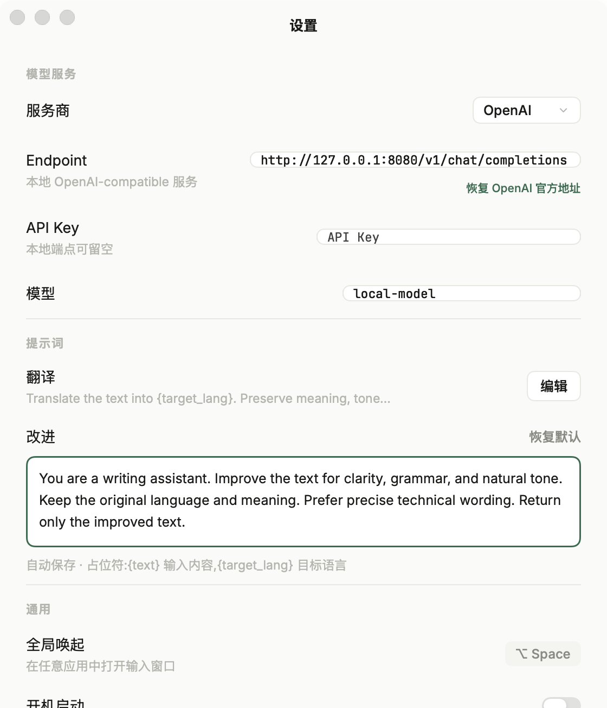
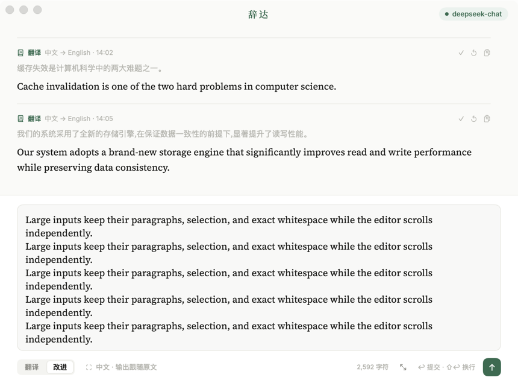
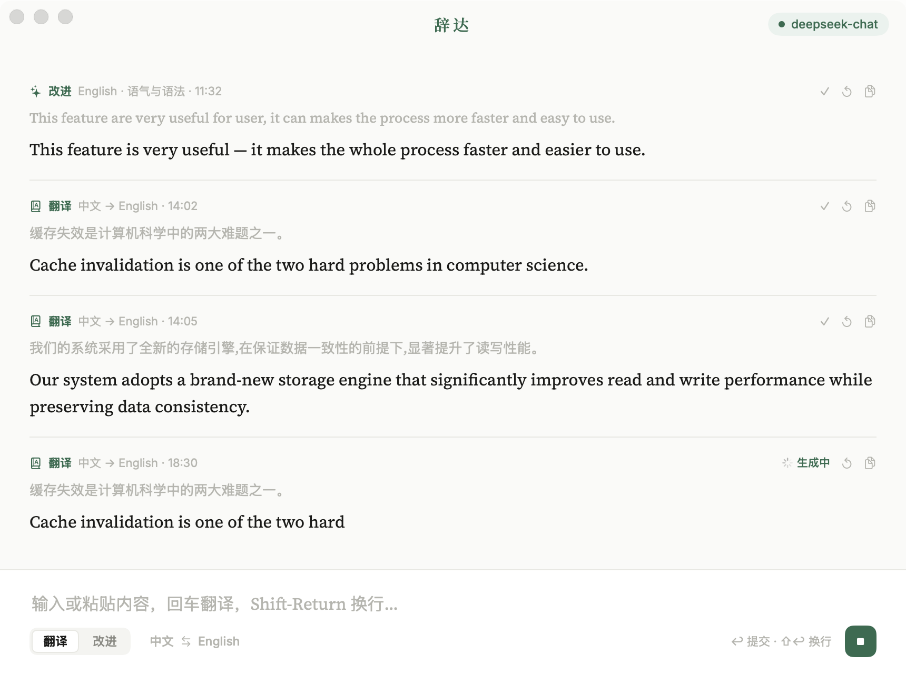
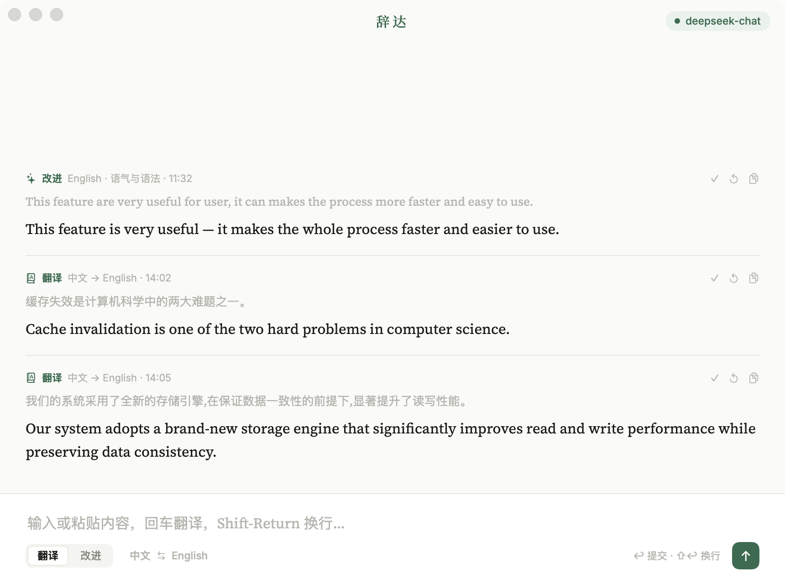

# Core Flow Audit

## Verdict

The original visual language was coherent, but custom window chrome and single-line input behavior broke the macOS interaction contract. The repaired flow keeps the Pencil typography, color, spacing, and flat settings structure while moving window behavior and text editing back to native AppKit controls.

## 1. Original Settings — unhealthy

- The visual hierarchy was close to the Pencil source.
- The traffic lights were decorative SwiftUI buttons instead of standard window controls.
- Fixed-height content could not accommodate endpoint configuration or smaller windows.
- Screenshot evidence alone could not verify keyboard focus or secure storage; those paths are covered by native-control regression tests.

## 2. OpenAI local endpoint configuration — healthy

- OpenAI reveals an endpoint field, editable model ID, API-key field, local-service explanation, and official-endpoint reset action.
- The flat rows, muted supporting text, green focus language, typography, and separators remain consistent with the Pencil Settings frame.
- A loopback endpoint may omit an API key; remote endpoints retain the API-key requirement.
- The content scrolls at the minimum window size rather than clipping lower settings.

## 3. Large multiline input — healthy

- The composer preserves the compact Pencil state for ordinary input, grows with moderate multiline content, and gives large documents roughly 38% of the available window height by default.
- A standard expand/restore action lets the user enter a larger focused editing state without losing text, selection, or scroll position.
- The native editor scrolls independently, preserves exact whitespace, supports selection, and shows a character count.
- Return submits; Shift-Return and Option-Return insert a newline.
- Very large source text is collapsed in history by default so one request cannot dominate the result viewport.

## 4. Streaming and auto-follow — healthy

- A result entry appears immediately and visibly grows from OpenAI-compatible SSE deltas.
- The active row exposes a clear `生成中` state and the submit button becomes a stop button.
- The history viewport follows throttled partial updates and performs a final follow at completion.
- Rendering updates are batched independently from scroll requests to avoid sacrificing frame pacing.

## 5. Completed main flow — healthy

- Completed entries expose a subtle native completion mark and retain retry/copy actions.
- The compact composer returns after submission, restoring space to results.
- Main and Settings windows use standard macOS close, minimize, zoom, resize, and title-bar behavior.

## Accessibility and evidence limits

- Native text fields, secure fields, text views, menus, switches, and standard window buttons preserve macOS keyboard and assistive-technology semantics.
- Explicit accessibility labels and identifiers cover the model button, composer, API key, endpoint, model, entry state, and primary actions.
- Screenshots cannot prove focus order, secure storage, cancellation, streaming timing, auto-follow, or foreground isolation. Those behaviors are verified by the hidden-window and local-SSE automated suites documented in `functional-qa.md`.

## Result

passed
