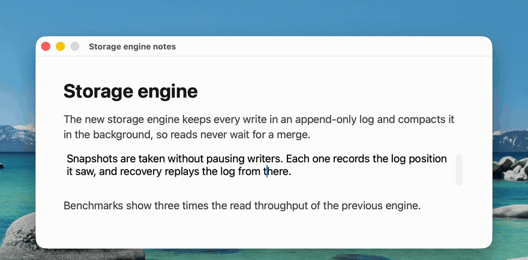

<p align="center">
  
</p>

<h1 align="center">辞达</h1>

<p align="center">
  用你选择的大模型，在 Mac 的任何地方翻译和润色文字。<br>
  <a href="https://cida-releases.xuanwo.io/latest/Cida.dmg">下载</a> · <a href="README.en.md">English</a>
</p>

<p align="center">
  
</p>

## 怎么用

- **选中文字，按 <kbd>⌥</kbd> <kbd>Space</kbd>。** 面板带着选中的文字出现，译文随即开始流出。中文和英文会自动互译。
- **按 <kbd>Tab</kbd> 再按 <kbd>Return</kbd>，改成润色。** 润色后的文字保持原来的语言。
- **屏幕上的文字，按 <kbd>⌥</kbd> <kbd>S</kbd>。** 框出要翻译的部分，辞达在本机识别后翻译。

按 <kbd>Esc</kbd> 回到原来的应用。面板隐藏后请求会继续完成，下次唤出时结果还在。

## 安装

需要 macOS 15 或更新版本，以及一个大模型服务。

1. 下载 [Cida.dmg](https://cida-releases.xuanwo.io/latest/Cida.dmg)。安装包经过 Developer ID 签名和 Apple 公证。
2. 打开 DMG，把辞达拖进「应用程序」，再从启动台或聚焦搜索打开。辞达只在菜单栏显示图标，不占用 Dock。
3. 按 <kbd>⌘</kbd> <kbd>,</kbd> 打开设置，点「复制配置提示词」，交给 Claude Code、Codex 等 AI 助手。它会问你用哪家服务，通过辞达的[命令行](#命令行)写好配置，再用 `check` 确认能用。

API Key 不经过助手：它会请你复制 Key 后运行一条命令，Key 直接存进钥匙串。支持 OpenAI Chat Completions、Responses 与 Anthropic Messages 三种接口，在本机运行的模型（例如 `http://127.0.0.1:8080`）不需要 Key。辞达本身免费，模型调用按服务商的价格计费。

两个权限都是可选的，在设置的「唤起」一栏点「去授权」即可开启：

| 权限 | 开启后 | 不开启时 |
| --- | --- | --- |
| 辅助功能 | 按 <kbd>⌥</kbd> <kbd>Space</kbd> 时自动带入选中的文字 | 先 <kbd>⌘</kbd> <kbd>C</kbd>，再在面板里 <kbd>⌘</kbd> <kbd>V</kbd> |
| 屏幕录制 | 用 <kbd>⌥</kbd> <kbd>S</kbd> 截图翻译 | 截图翻译不可用 |

## 隐私

- API Key 只存在 macOS 的钥匙串里。
- 不保存历史记录，不收集任何数据，翻译和润色的请求只发往你选择的服务商。
- 截图在本机用 Apple 的 Vision 识别，图片不会离开你的 Mac。

## 快捷键

| 按键 | 作用 |
| --- | --- |
| <kbd>⌥</kbd> <kbd>Space</kbd> | 显示或隐藏面板 |
| <kbd>⌥</kbd> <kbd>S</kbd> | 截图翻译 |
| <kbd>Tab</kbd> | 在翻译和改进之间切换 |
| <kbd>Return</kbd> | 执行（<kbd>⇧</kbd> <kbd>Return</kbd> 换行） |
| <kbd>Esc</kbd> | 隐藏面板 |

两个全局快捷键都可以在设置里重新录制。

## 命令行

应用里的可执行文件就是辞达的命令行，不需要另外安装。它与正在运行的辞达共用同一份配置，改完立即生效：

```sh
cida=/Applications/Cida.app/Contents/MacOS/Cida
$cida config schema                        # 全部字段、取值与说明
$cida config show
$cida config set model=deepseek-chat       # 一次可写多项，也有 unset 与 reset
pbpaste | $cida config set api-key --stdin
$cida check --verbose                      # 真的请求一次，失败时给出请求与响应
```

每个命令都可以加 `--json`。API Key 只从 `--stdin`、`--file` 或 `--env` 读取，写在命令行参数里会被拒绝。字段的完整说明见 [`Design/spec/configuration.md`](Design/spec/configuration.md)。

## 更新

辞达每天检查一次 `https://cida-releases.xuanwo.io/appcast.xml`，有新版本时在面板里给出更新说明，确认后自己下载并安装。检查不附带任何系统信息，可以在设置的「更新」一栏关掉。

## 卸载

退出辞达，把「应用程序」里的辞达移到废纸篓。想清掉全部痕迹，再删除「钥匙串访问」里名为 `com.xuanwo.Cida` 的条目和 `~/Library/Preferences/com.xuanwo.Cida.plist`。

## 参与开发

```sh
git clone https://github.com/Xuanwo/cida.git
cd cida
swift run Cida
```

需要 Xcode 26 或更新版本。构建、测试和发版见 [`docs/development.md`](docs/development.md)，设计稿在 [`Design/`](Design/README.md)，提交改动前请阅读 [`AGENTS.md`](AGENTS.md)。

## 许可证

[Apache-2.0](LICENSE)。

名字取自《论语》「辞达而已矣」：言辞能把意思表达清楚就够了。
