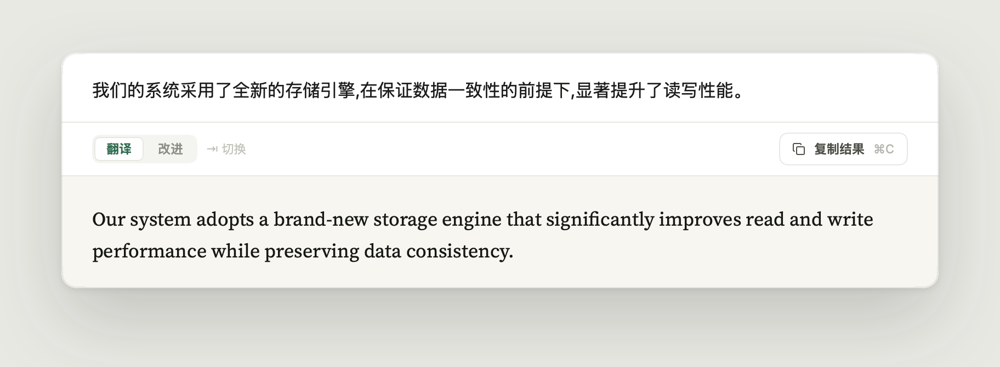
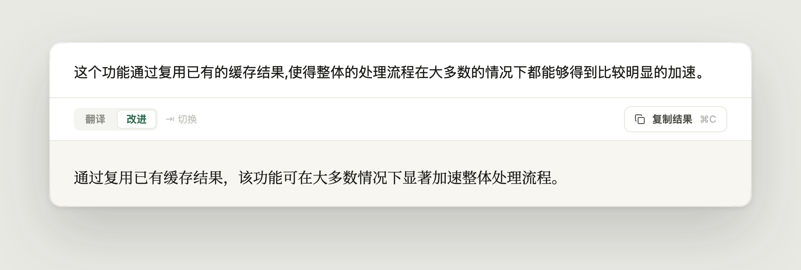
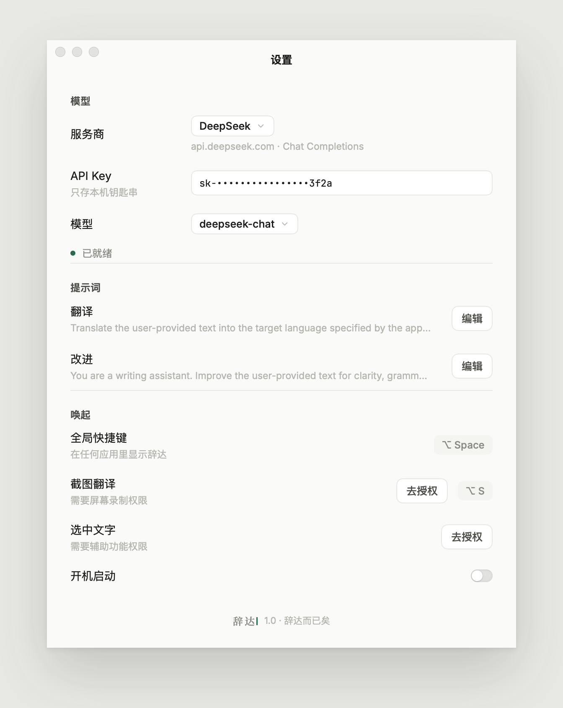

<p align="center">
  
</p>

<h1 align="center">Cida · 辞达</h1>

<p align="center">
  Translate and polish text anywhere on your Mac, one shortcut away.<br>
  <a href="https://github.com/Xuanwo/cida/releases/latest">Download</a> · <a href="README.zh-Hans.md">简体中文</a>
</p>



Cida lives in the menu bar. Press <kbd>⌥</kbd> <kbd>Space</kbd> in any app and a panel appears with the text you selected, already being translated; press <kbd>Tab</kbd> to improve the writing instead. The name comes from the *Analects*: 辞达而已矣, words need only get the meaning across.

## Features

- **Stays out of the way.** The panel takes your typing without switching apps, and <kbd>Esc</kbd> drops you back where you were. A request keeps streaming while the panel is hidden, and the caret in the menu bar breathes until it is done.
- **Brings the selection in.** With the Accessibility permission, the text selected in the frontmost app becomes the source and is translated at once.
- **Reads the screen.** <kbd>⌥</kbd> <kbd>S</kbd> freezes the screen; frame any text and Cida recognizes it on your Mac with Vision and translates it.
- **Translates or improves.** Chinese and English are detected and translated into each other; improving keeps the text in its own language.
- **Uses your model.** DeepSeek, OpenAI, Moonshot, 智谱 GLM, or any OpenAI-compatible endpoint, including a local server that needs no key.
- **Keeps nothing.** The API key lives in Keychain. There is no history and no telemetry, and screenshots never leave your Mac.



The interface is in Simplified Chinese.

## Install

Cida needs macOS 15 or newer.

1. Download `Cida-<version>.zip` from the [latest release](https://github.com/Xuanwo/cida/releases/latest). It is signed with a Developer ID and notarized by Apple.
2. Unzip it and move **Cida.app** to Applications.
3. Open it, press <kbd>⌘</kbd> <kbd>,</kbd>, pick a provider and paste your API key.

<p align="center">
  
</p>

## Keys

| Key | Action |
| --- | --- |
| <kbd>⌥</kbd> <kbd>Space</kbd> | Show or hide the panel, bringing in the selected text |
| <kbd>⌥</kbd> <kbd>S</kbd> | Frame text on screen and translate it |
| <kbd>Return</kbd> | Run the action (<kbd>⇧</kbd> <kbd>Return</kbd> for a new line) |
| <kbd>Tab</kbd> | Switch between translate (翻译) and improve (改进) |
| <kbd>⌘</kbd> <kbd>C</kbd> | Copy the selection, or the result when nothing is selected |
| <kbd>⌘</kbd> <kbd>.</kbd> | Stop |
| <kbd>Esc</kbd> | Hide |
| <kbd>⌘</kbd> <kbd>,</kbd> | Settings |

Both global shortcuts can be recorded again in Settings.

## Build from source

```sh
git clone https://github.com/Xuanwo/cida.git
cd cida
swift run Cida
```

Building needs Xcode 26 or newer. [`docs/development.md`](docs/development.md) covers signed builds, tests, releases and the architecture, and [`Design/`](Design/README.md) holds the design Cida is built from. Contributions follow [`AGENTS.md`](AGENTS.md).

## License

Cida is licensed under [Apache-2.0](LICENSE). It bundles Inter, Source Serif 4, Noto Serif SC and JetBrains Mono under the SIL Open Font License 1.1, and Lucide icons under the ISC License.
